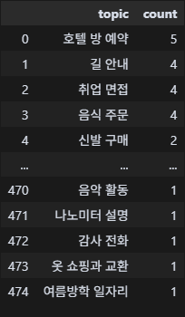

# Title (Please modify the title)
## Team

|  |  |  |  |  |
| :--------------------------------------------------------------: | :--------------------------------------------------------------: | :--------------------------------------------------------------: | :--------------------------------------------------------------: | :--------------------------------------------------------------: |
|            [이승민](https://github.com/UpstageAILab)             |            [최웅빈](https://github.com/UpstageAILab)             |            [이경도](https://github.com/UpstageAILab)             |            [이상원](https://github.com/UpstageAILab)             |            [김재덕](https://github.com/UpstageAILab)             |
|                            팀장, 데이터 생성                            |                            EDA, 모델 테스트                             |                            하이퍼파리미터 실험                             |                            데이터 전처리                             |                            분석 및 실험                             |

## 0. Overview
### Environment
- IDE: Cusorai,Vscode
- tool : Hugging Face, Hydra, WanDB 
- API: Upstage API

## 1. Competiton Info
- 대회명: Dialogue Summarization | 일상 대화 요약
- 설명: 학교 생활, 직장, 쇼핑, 여행 등 광범위한 일상 대화를 요약하는 것이 목표 <br>팀의 목표는 베이스 라인 성능을 넘어서고, 각자의 가설을 기반으로 고득점을 당성

- _Write competition information_

### Timeline
2025.07.25 10:00 ~ 2025.08.06 19:00

## 2. Components

### Directory

- _Insert your directory structure_

e.g.
```
├── code
│   ├── jupyter_notebooks
│   │   └── model_train.ipynb
│   └── train.py
├── docs
│   ├── pdf
│   │   └── (Template) [패스트캠퍼스] Upstage AI Lab 1기_그룹 스터디 .pptx
│   └── paper
└── input
    └── data
        ├── eval
        └── train
```

## 3. Data descrption

### Dataset overview

- 영어를 한국어로 번역한 데이터셋으로 대화-요약 쌍으로 구성 되며 <br> train(12,458), validation(498), test(498) 

### EDA

- _Describe your EDA process and step-by-step conclusion_

### Data Processing

- Topic 히스토그램 





- 화자인원수 분석
  - 

- 2명의 화작 대회 횟수 히스토그램


- 요약 문자 길이 히스토그램


- 내용/요약 문자길이 상관계수(피어슨) : 0.4904


- 프롬프트 데이터 생성 v1 32,881 결과 46.969775


- 프롬프트 데이터 생서 v2(사건중심,화자태그 추가) 51,753 결과 48.1078


- 프롬프트 데이터 생성 v2 12,457 샘플링 결괴 47.1161


- train 데이터 검토 프롬프트


- 평가 전처리 train 12,457 → 12,347 (-110)
  - 전략
    - 데이터 일치 : A
    - 데이터 일치 + 부분적 일치 : B
    - 데이터 v2 + A
    - 데이터 v2 + B

## 4. Modeling

### Model descrition

- hyunwoongko/kobart 영화리뷰 감성 학습 47.9140
- EbanLee/kobart-summary-v3 한국어 도서 요약 47.18
- gogamza/kobart-summarization 한국 뉴스 요약 47.2133
- ainize/kobart-news 한국 뉴스 요약 45.2095

- 하이퍼파라미터
  - decoder max legth 512 last : 47.4883
  - A output : topic + summary last : 46.7900
  - B ouput : topic → test → topic(predict)
      - input : dialogue + topic bast : 47.6004
  - weight_decay0.05 bast : 47.8631
  - early_stopping20 last : 47.9140
  - decoder max legth 512 + early_stopping20 + weight_decay0.05 + B : 47.0271

## 5. Result

### Leader Board


### Presentation

- _Insert your presentaion file(pdf) link_

## etc

### Meeting Log

- _Insert your meeting log link like Notion or Google Docs_

### Reference

- _Insert related reference_
